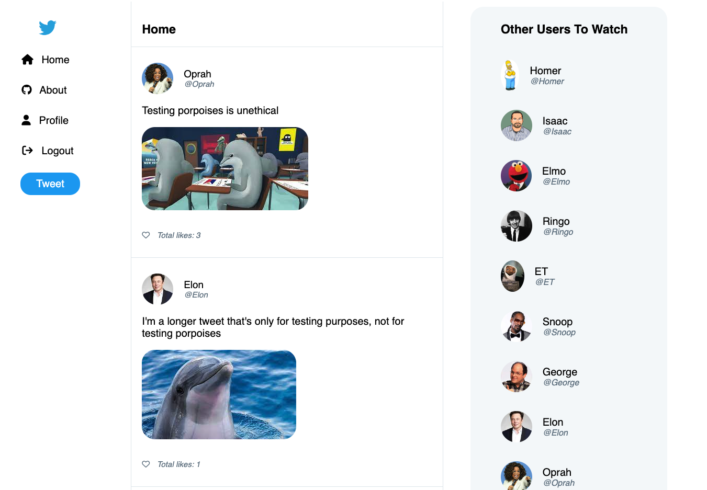

# twitter_clone
i-tweet is a twitter clone. It is a full-stack web application with a RESTful API backend using React, Redux, JavaScript, CSS, HTML, Python and more. 

## Features:
1. Create an account, login, logout, and login with a Demo account.
2. Create, edit, and delete tweets.
3. Create, edit, and delete replies.
4. Like and unlike tweets.
5. View feed, profile, and other users' profiles.
6. Upload images for a profile picture when signing up
7. Upload images when creating and editing a tweet
 
## Technologies used:
1. Docker
2. React
3. Redux
4. Python
5. Flask
6. SQLAlchemy
7. PostgreSQL
8. AWS S3
9. HTML
10. CSS
11. JavaScript

## **Screen Shots**

### Home Page


### Tweet Details and Replies


### User Profile


## **To get started on your local environment**

1. Clone the repo and run `pipenv install` to install the dependencies
2. Create .env file, for example:
    ```
    SECRET_KEY=[add secret key here]
    DATABASE_URL=sqlite:///dev.db
    ```
3. Start pipenv shell `pipenv shell`
4. Migrate and seed database `flask db migrate` and `flask seed all`
5. Run flask `flask run`
6. cd into the `react-app`
7. run `npm install` to install the frontend dependencies
8. run `npm start` to start the frontend
9. go to [localhost:3000](localhost:3000) in your browser

# **API Documentation**
### Backend Routes
Prepend all routes below with /api

### /auth/login
POST credentials for authentication

### /auth/signup
POST create new user

### /auth/logout
DELETE user session

### /users/tweets
GET my tweets

### /users/replies
GET my replies

Require Authentication: TRUE

Request Body:
N/A

Response Body
Status Code: 200

Require Authentication: TRUE

```
{
    "Tweets" :
    [
        {
            "id": 1,
            "userId": 1,
            "username": "demo",
            "body": "Sample Body",
            "created_on":  "2022-12-12", 
            "last_update_on": "2022-12-12"
        },
        {
            "id": 2,
            "userId": 1,
            "username": "demo",
            "body": "Sample Body",
            "created_on":  "2022-12-12", 
            "last_update_on": "2022-12-12"
        }
    ]
}  
```

### /users/comments
GET my Comments

Require Authentication: TRUE

Request Body:
N/A

Response Body

Status Code: 200

Require Authentication: TRUE
```
{
    "Comments" :
    [
        {
            "id": 1,
            "userId": 1,
            "username": "demo",
            "tweetId":1,
            "body": "Sample Body",
            "created_on":  "2022-12-12", 
            "last_update_on": "2022-12-12"
        },
        {
            "id": 2,
            "userId": 1,
            "username": "demo",
            "tweetId":1,
            "body": "Sample Body",
            "created_on":  "2022-12-12", 
            "last_update_on": "2022-12-12"
        }
    ]
}
```                                         

### /tweets
GET all tweets

Require Authentication: TRUE

Request Body:
N/A

Response Body

Status Code: 200

```
{
    "Tweets" :
    [
        {
            "id": 1,
            "userId": 1,
            "username": "demo",
            "body": "Sample Body",
            "created_on":  "2022-12-12", 
            "last_update_on": "2022-12-12"
            "Likes" :
            {
                total: 3
                iLiked: False
            },
            "totalComments" : 7
            
        },
        {
            "id": 2,
            "userId": 2,
            "username": "demo",
            "body": "Sample Body",
            "created_on":  "2022-12-12", 
            "last_update_on": "2022-12-12"
            "Likes" :
            {
                total: 3
                iLiked: False
            },
            "totalComments" : 7
        }
    ]
}
```

### /tweets
POST a new tweet

Require Authentication: TRUE

Request Body
```
{
    "body": "Sample Body"
}
```

Response Body

Status Code: 201

```
{
    "id": 2,
    "userId": 2,
    "username": "demo",
    "body": "Sample Body",
    "created_on":  "2022-12-12", 
    "last_update_on": "2022-12-12"
}
```

 ### /tweets/:tweetId
GET a specific tweet and it's associated comments, and cumulative likes

Require Authentication: TRUE

Response Body

Status Code: 200

```
{
    "Tweets" :
    {
        "id": 1,
        "userId": 1,
        "username": "demo",
        "body": "Sample Body",
        "created_on":  "2022-12-12", 
        "last_update_on": "2022-12-12",
        "Likes" :
            {
                total: 3
                iLiked: False
            },
        "Comments" :
        [
            {
                "id": 1,
                "userId": 1,
                "username": "demo",
                "tweetId":1,
                "body": "Sample Body",
                "created_on":  "2022-12-12", 
                "last_update_on": "2022-12-12",
                
            }
        ]
    }
}  
```    

### /tweets/:tweetId
PUT to update a specific tweet

Require Authentication: TRUE

Request Body

```
{
    "body": "Sample Body"
}
```

Response Body

Status Code: 200

Require Authentication: TRUE

```
{
    "id": 2,
    "userId": 2,
    "username": "demo",
    "body": "Sample Body",
    "created_on":  "2022-12-12", 
    "last_update_on": "2022-12-12"
}
```

### /tweets/:tweetId
DELETE a specific tweet

Require Authentication: TRUE

Request Body:
N/A

Response Body

Status Code: 200

```
{
    "message": "Successfully deleted",
    "Status Code": 200
    
}
```

### /tweets/:tweetId/comment
POST a new comment

Require Authentication: TRUE

Request Body
```
{
    "body": "Sample Body"
}
```

Response Body

Status Code: 201

```
{
    "id": 2,
    "userId": 2,
    "username": "demo",
    "tweetId": 1,
    "body": "Sample Body",
    "created_on":  "2022-12-12", 
    "last_update_on": "2022-12-12"
}
```

### /comments/:commentId
PUT to update a specific comment

Require Authentication: TRUE

Request Body

```
{
    "body": "Sample Body"
}
```

Response Body

Status Code: 200

```
{
    "id": 2,
    "userId": 2,
    "username": "demo",
    "tweetId": 1,
    "body": "Sample Body",
    "created_on":  "2022-12-12", 
    "last_update_on": "2022-12-12"
}
```

### /comments/:commentId

DELETE a specific comment

Require Authentication: TRUE

Request Body
N/A

Response Body

Status Code: 200

```
{
    "message": "Delete Successfully",
    "Status Code": 200
}
```

### /tweets/:tweetId/likes

POST a new like

Require Authentication: TRUE

Request Body
```
{
    "body": "like"
}
```

Response Body

Status Code: 200

```
{
    "id": 2,
    "userId": 2,
    "username": "demo",
    "tweetId": 1,
    "created_on":  "2022-12-12", 
    "last_update_on": "2022-12-12"
}
```

### /likes/:likeId

DELETE a specific like

Require Authentication: TRUE

Request Body
N/A

Response Body
Status Code: 200

```
{
    "message": "Delete Successfully",
    "Status Code": 200
}
```

### /users/:userId/follows

POST a new follow for the current user on a specific user 

Require Authentication: TRUE

Request Body

```
{
    "follow": 'Y'
}
```

Response Body

Status Code: 200

```
{
    "id": 2,
    "userId": 2,
    "answerId": 1,
    "voteDirection": "Down"
}
    
```
### /follows/:followId
DELETE a specific follow

Require Authentication: TRUE

Request Body:
N/A

Response Body

Status Code: 200

```
{
    "message": "Successfully deleted",
    "Status Code": 200
    
}
``` 
